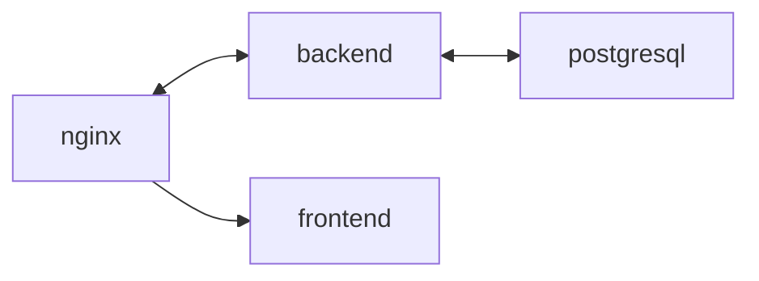

## Kittygram


#### Kittygram - это веб приложение для любителей котиков, где каждый желающий может зарегистрироваться, опубликовать фото своего котика или кошечки. Даже если нет шерстяного питомца, его можно выдумать и опубликовать. Есть возможность оставить достижение пушистого, например: "приносит игрушку", "миленький". Достижение может создать любой желающий любитель кошек.
#### Клонируйте репозиторий:
```
https://github.com/hix9/kittygram_final/
```
#### Продакшн-версия:
 - готова для работы на сервере
 - настроены контейнеры и тома для передачи и хранения данных
#### Инструкция для работы на сервере:
Для подключения к Вашему серверу по протоколу SSH Вам понадобятся следующие данные:

 - login для подключения к серверу;
 - ip - IP-адреc сервера, а также желательно доменное имя;
 - passphrase - пароль от закрытого SSH-ключа;
 - файл с расширением .pub — открытый SSH-ключ;
 - файл без расширения — закрытый SSH-ключ.

Для подключения используйте команду:
```
ssh -i путь_до_файла_с_SSH_ключом/название_файла_закрытого_SSH-ключа login@ip
```
Форкните проект в свой GitHub.

Заполните следующие секреты проекта:
 - DOCKER_PASSWORD - пароль для подключения к своему DockerHub;

 - DOCKER_USERNAME - username от своего DockerHub;

 - HOST - IP-адрес вашего сервера;

 - USER - ваш login на сервере;

 - SSH_KEY - содержимое текстового файла с закрытым SSH-ключом;

 - SSH_PASSPHRASE - passphrase для закрытого ключа;

 - TELEGRAM_TO - ID своего телеграм-аккаунта. Узнать свой ID можно у телеграм-бота @userinfobot. Бот станет отправлять уведомления в аккаунт с указанным ID;

 - TELEGRAM_TOKEN - токен вашего бота. Получить этот токен можно у телеграм-бота @BotFather.

Установите Docker и Docker Compose - утилиту для сборки и запуска сети на сервере
Данные для работы приложения представлениы в файле .env.example (можете указать собственные данные по примеру)
#### Как заполнить .env
На сервере нужно создать два .env файла с данными:

В корневой папке создать файл .env и указать в нем:

 - SECRET_KEY - секретный ключ для шифрования в Django.

 - ALLOWED_HOSTS = [IP-адрес сервера, '127.0.0.1', 'localhost', доменное имя сервера]

В корне проекта создать файл .env и указать в нем:

 - POSTGRES_USER - имя пользователя БД (необязательная переменная, значение по умолчанию — postgres);

 - POSTGRES_PASSWORD - пароль пользователя БД (обязательная переменная для создания БД в контейнере);

 - POSTGRES_DB - название базы данных (необязательная переменная, по умолчанию совпадает с POSTGRES_USER).

 - DB_HOST - адрес, по которому Django будет соединяться с базой данных. При работе нескольких контейнеров в сети Docker network вместо адреса указывают имя контейнера, где запущен сервер БД, — в нашем случае это контейнер db;

 - DB_PORT - порт, по которому Django будет обращаться к базе данных. 5432 — это порт по умолчанию для PostgreSQL.
Для работы на сервере вам необходимо изменить константу DOMAIN на ваш домен.

Запустите команду для сборки в фоновом режиме(требуется разрешение администратора для всех операций с Docker)
```
docker compose -f docker-compose.production.yml up -d
```
 - Выполните миграции в директории с файлом docker.compose.prodictuin/yml для работы с БД
```
docker compose -f docker-compose.production.yml exec backend python manage.py migrate
```
 - соберите и скопируйте статику для корректой работы на сервере
```
docker compose -f docker-compose.production.yml exec backend python manage.py collectstatic
docker compose -f docker-compose.production.yml exec backend cp -r /app/static/. /backend_static/static/
```
#### Инструкция для локальной работы на вашей машине:
##### Вы можете использовать обычную версию для тестирования самого приложения, если заходите его модифицировать, перед тем, как запускать на сервере.
 - в проекте предусмотрена работа на локальном адресе http://localhost:9000
 - запустите команду для сборки в фоновом режиме(требуется разрешение администратора для всех операций с Docker)
```
docker compose -f docker-compose.yml up -d
```
 - Выполните миграции в директории с файлом docker.compose.prodictuin/yml для работы с БД
```
docker compose -f docker-compose.yml exec backend python manage.py migrate
```
 - соберите и скопируйте статику для корректого отображения
```
docker compose -f docker-compose.yml exec backend python manage.py collectstatic
```
### Описание проекта "Контейнеты для Kittygram и CI/CD"

#### В проекте настроена гибкая система автоматического деплоя на сервер:
1. Push в ветку main запустит весь процесс автоматического деполя
2. Push в любую созданную ветку запустит тестирование, при этому сборка и деплой происходить не будут
#### Описаны Dockerfile для сборки образов, используемых в проекте
#### Описаны .yml сценарии для последовательной сборки образов:
 - docker-compose.yml для локальной сборки
 - docker-compose.production.yml для сборки на сервере с использованием CI/CD
#### Описана конфигурация Nginx сервера для приёма внешних запросов:
 - сервер пропускает протоколы TLSv1.2 TLSv1.3 для защиты от атак типа "BEAST"
 - сервер принимает решение, какие шрифты использовать
 - токены Nginx скрыты для клиента
 - определён клиентский буфер и максимальный размер тела запроса от клиента для защиты от DoS-атак, передача данных ускорена за счёт двух буферов размером 1 MB
#### Представлен экземпляр для переменных окружения для простоты использования, скрыты конфиденциальные данные
| Технологии и инструменты | Описание |
| --- | --- |
| Python | Высокоуровневый язык программирования общего назначения. |
| Django | Фреймворк для веб-разработки на Python, упрощающий разработку сложных веб-приложений. |
| Django Rest Framework | Расширение для Django, которое упрощает создание RESTful API. |
| PostgreSQL | Реляционная система управления базами данных с открытым исходным кодом. |
| Gunicorn | Веб-сервер для запуска приложений Python WSGI, используется для обслуживания Django. |
| Nginx | Обратный прокси-сервер и HTTP-сервер, часто используется для обслуживания статических файлов и разгрузки Gunicorn. |
| Docker | Платформа для разработки, доставки и запуска приложений в контейнерах. |
| Docker Compose | Инструмент для определения и запуска мультиконтейнерных приложений. |
| Git | Система контроля версий для отслеживания изменений в исходном коде. |
| GitHub | Хостинг репозиториев Git и платформа для совместной работы над проектами. |
| GitHub Actions | Технология для автоматизации процесса развёртки. |
| CI/CD | Методология процессов разработки, тестирования и доставки программного обеспечения. |
#### Автор: [Баринов Станислав](https://github.com/hixwizard)
#### Tools: Linux(fish, tmux, nano), VSCode(optional)
