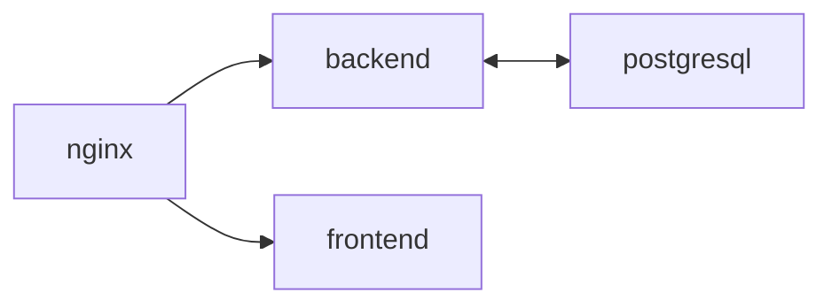

[Развёрнутый проект](https://kitty-test.sytes.net/)


Кто автор проекта?
Какие технологии используются?

## Kittygram
#### Kittygram - это веб приложение для любителдей котиков, где каждый желающий может зарегистрироваться, опубликовать фото своего котика или кошки. Есть возможность оставить достижение пушистого, например: "приносит игрушку", "миленький". Достижение может создать любой желающий любитель кошек.
#### Клонируйте репозиторий:
```
https://github.com/hix9/kittygram_final/
```
#### Продакшн-версия:
 - готова для работы на сервере
 - настроены контейнеры и тома для передачи и хранения данных
#### Инструкция для работы на сервере:
 - установите Docker и Docker Compose - утилиту для сборки и запуска сети на сервере
 - данные для работы представлениы в файле .env.example (можете указать собственные данные по примеру)
 - для работы на сервере вам необходимо изменить константу DOMAIN на ваш домен
 - запустите команду для сборки в фоновом режиме(требуется разрешение администратора для всех операций с Docker)
```
docker compose -f docker-compose.production.yml up -d
```
 - Выполните миграции в директории с файлом docker.compose.prodictuin/yml для работы с БД
```
docker compose -f docker-compose.production.yml exec backend python manage.py migrate
```
 - соберите и скупируйте статику для корректой работы на сервере
```
docker compose -f docker-compose.production.yml exec backend python manage.py collectstatic
docker compose -f docker-compose.production.yml exec backend cp -r /app/static/. /backend_static/static/
```
#### Инструкция для локальной работы на вашей машине:
 - в проекте предусмотрена работа на локальном адресе http://localhost:9000
 - запустите команду для сборки в фоновом режиме(требуется разрешение администратора для всех операций с Docker)
```
docker compose -f docker-compose.production.yml up -d
```
 - Выполните миграции в директории с файлом docker.compose.prodictuin/yml для работы с БД
```
docker compose -f docker-compose.production.yml exec backend python manage.py migrate
```
##### Вы можете использовать обычную версию для тестирования самого приложения, если заходите его модифицировать, перед тем, как запускать на сервере.
### Описание проекта "Контейнеты для Kittygram и CI/CD"

#### В проекте настроена гибкая система автоматического деплоя на сервер:
1. Push в ветку main запустит весь процесс автоматического деполя
2. Push в любую созданную ветку запустит тестирование, при этому сборка и деплой происходить не будут
#### Описаны Dockerfile для последовательной сборки образов
#### Описана конфигурация Nginx сервера для приёма внешних запросов:
 - сервер пропускает протоколы TLSv1.2 TLSv1.3 для защиты от атак типа "BEAST"
 - сервер принимает решение, какие шрифты использовать
 - токены Nginx скрыты для клиента
 - определён клиентский буфер и максимальный размер тела запроса от клиента для защиты от DoS-атак, передача данных ускорена за счёт двух буферов размером 1 MB
#### Представлен экземпляр для переменных окружения для простоты использования, скрыты конфиденциальные данные

### Автор: [Баринов Станислав](https://github.com/hix9)
Разрабатывалось на Linux при помощи терминала fish и мультиплексора tmux
| Технологии и инструменты | Описание |
| --- | --- |
| Docker | Платформа для разработки, доставки и запуска приложений в контейнерах. |
| Docker Compose | Инструмент для определения и запуска мультиконтейнерных приложений. |
| GitHub Actions | Технология для автоматизации процесса развёртки. |
| CI/CD | Методология процессов разработки, тестирования и доставки программного обеспечения. |
